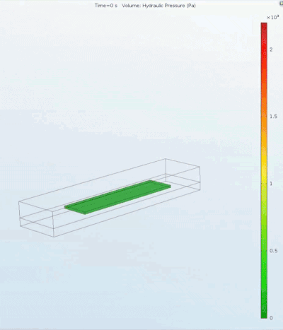
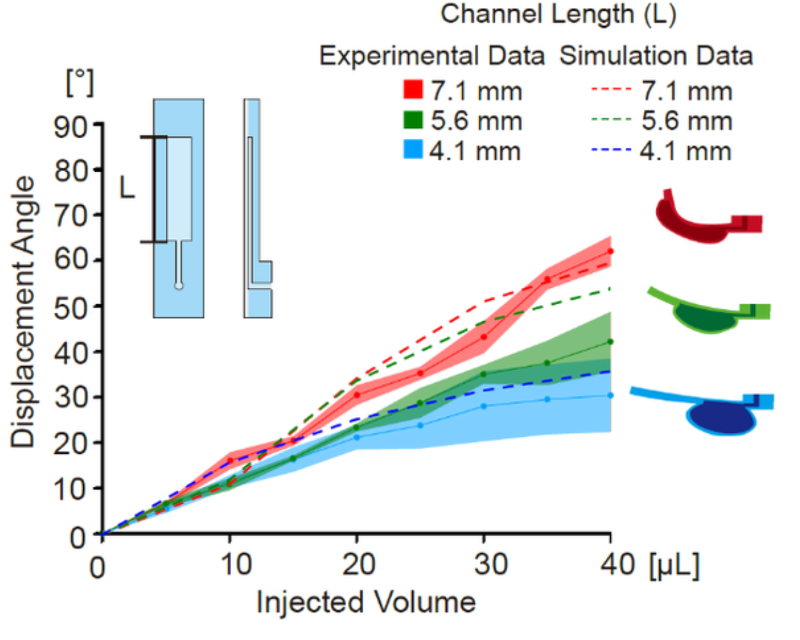

# FSI Digital Twin for Soft Polymer Actuators

Fully coupled fluid-structure interaction (FSI) simulation of a pneumatic balloon actuator in a soft robotic platform, validated against experiment across three channel geometries. Simulation results directly guided actuator design and were published in *Advanced Intelligent Systems* (2021).

**My contribution:** COMSOL FSI model design, constitutive model selection and parameter fitting, solver configuration, and experimental validation (in collaboration with wet-lab co-authors).

---

## Demo

### Full Wing Actuation — DraBot


*Bilateral hindwing deflection controlled independently via balloon actuators. Differential flapping steers the robot's direction of travel.*

### Balloon Actuator — Experiment vs. Simulation

| Experiment | COMSOL FSI Simulation |
|:---:|:---:|
|  |  |

*Rectangular microchannel (7.1 × 1.8 × 0.15 mm) pressurized at 2.5 µL/s. Ecoflex membrane inflates asymmetrically, driving out-of-plane wing deflection.*

**Validation — displacement angle vs. injected volume across three channel lengths:**



*Simulation tracks experiment across all geometries (L = 4.1, 5.6, 7.1 mm) without geometry-specific parameter tuning. Nonlinear stiffening above 60° is captured — the regime where linear elastic models fail.*

---

## Physical Problem

The hindwing actuator in DraBot operates by pressurizing a rectangular microchannel sandwiched between a stiff PDMS layer and a compliant Ecoflex 00-30 membrane. Asymmetric compliance causes the membrane to inflate preferentially, generating a bending moment that deflects the wing out-of-plane.

Three features make this problem nontrivial:

- Both materials operate well outside the linear elastic regime
- Fluid pressure and structural deformation are tightly coupled — the expanding solid reshapes the fluid domain at every timestep
- Target deflection angles exceed 80°, placing the problem firmly in the geometrically nonlinear regime

A purely analytical approach is intractable. The FSI digital twin was built to run a parametric study over channel length and identify the geometry that hits the target deflection at a given injected volume, before fabricating any physical devices.

---

## Simulation Summary

| Item | Detail |
|---|---|
| Software | COMSOL Multiphysics 5.3a |
| Physics | Laminar Flow + Solid Mechanics + FSI (ALE moving mesh) |
| PDMS model | 5-parameter Mooney-Rivlin |
| Ecoflex model | 2-term Ogden (constants fit from our tensile data, R² = 0.995) |
| Domain | 3D cuboid, 12 mm × 3 mm lateral/side |
| Channel geometry | Width 1.8 mm × Height 0.15 mm × Length 4.1 / 5.6 / 7.1 mm |
| Flow rate | 2.5 µL/s (volume-controlled inlet) |
| Study type | Time-dependent, nonlinear |
| Validation | Displacement angle vs. injected volume, 3 channel lengths, 3 cycles each |

**Design outcome:** The 7.1 mm channel was selected for all DraBot experiments based on the parametric study. Simulated inlet pressure matched experimental hydraulic pressure within ~5%.

---

## Repository Structure

```
FSI-soft-actuator-COMSOL/
├── README.md
├── figures/
│   ├── sim_vs_exp_validation.png   — Fig 1g / Fig S3b from paper
│   ├── mesh_domain.png             — 3D domain isometric view (Fig S3a)
│   └── ogden_fit.png               — Ecoflex stress-strain fit (Fig S2b)
├── media/
│   ├── drabot_wing.gif             — full DraBot bilateral wing actuation
│   ├── balloon_exp.gif             — close-up experimental balloon expansion
│   └── balloon_sim.gif             — COMSOL FSI simulation output
└── simulation/
    ├── model_notes.md              — full physics, BCs, solver, design judgment
    ├── mesh_convergence.md         — mesh independence verification
    └── material_params/
        └── ecoflex_ogden.md        — constitutive model + fitted constants
```

---

## Publication

> Kumar\*, Ko\*, **Zhou**, Hoque, Arya, Varghese.
> "Microengineered Materials with Self-Healing Features for Soft Robotics."
> *Advanced Intelligent Systems*, 3, 2100005 (2021).
> https://doi.org/10.1002/aisy.202100005

\* Equal contribution. COMSOL FSI simulations by Y. Zhou.

---

## Skills Demonstrated

- Hyperelastic constitutive modeling (Mooney-Rivlin, Ogden) for soft polymers
- Fully coupled FSI in COMSOL with ALE moving mesh
- Experimental design for model validation (tensile testing → parameter fitting → cross-geometry prediction)
- Simulation-driven design: parametric geometry study informing hardware fabrication decisions
- Physical judgment: domain truncation, gravity neglect justification, constitutive model selection rationale
