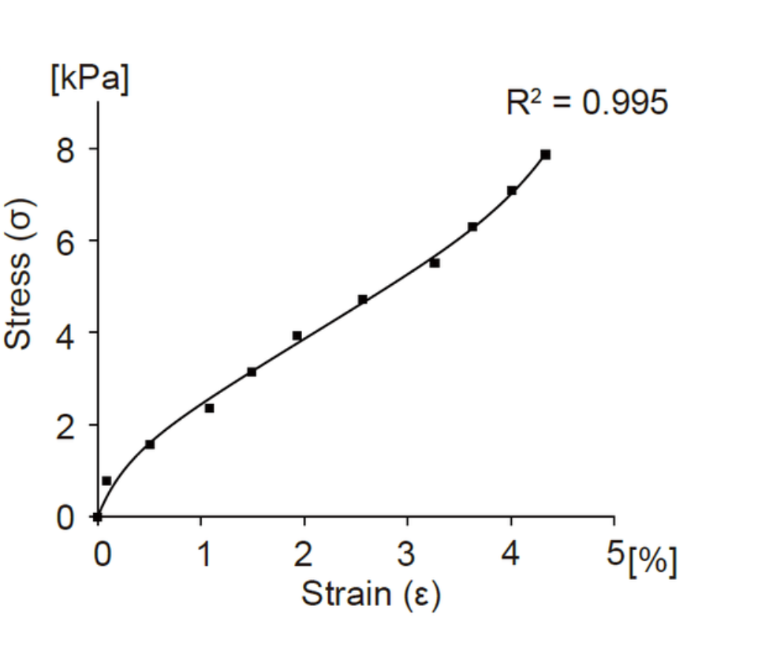

# Ecoflex 00-30 — Ogden Constitutive Model Parameters

## Why This Matters

The Ecoflex membrane is the mechanically active element in the balloon actuator:
it inflates under pressure and drives the bending moment. Getting its constitutive
model right is the single most important factor in simulation accuracy. A poor
material model here propagates directly into wrong deflection predictions,
regardless of how well the fluid or FSI coupling is handled.

---

## Experimental Protocol

| Item | Detail |
|---|---|
| Instrument | ElectroForce 3220 Series III (TA Instruments) |
| Sample geometry | ASTM Type V dumbbell |
| Sample thickness | 4 mm |
| Crosshead speed | 0.25 mm/min |
| Load cell | 225 N |
| Replicates | 3–4 per condition |

Samples were prepared by casting Ecoflex 00-30 (Smooth-On) at the same
10:1 base:curing agent ratio used in DraBot fabrication, and curing under
identical conditions. This ensures the mechanical data reflects the actual
material in the device, not a generic literature value.

---

## Constitutive Model

The 2-term Ogden strain-energy function:

$$W_s = \sum_{p=1}^{2} \frac{\mu_p}{\alpha_p}\left(\lambda_1^{\alpha_p} + \lambda_2^{\alpha_p} + \lambda_3^{\alpha_p}\right) + \frac{1}{2}K(J_{el}-1)^2$$

Engineering stress for uniaxial tension (used for curve fitting):

$$\sigma(\lambda) = \frac{1}{\lambda^2}\left[\mu_1 \lambda^{\alpha_1} + \mu_2 \lambda^{\alpha_2} - \mu_1\lambda^{-\alpha_1/2} - \mu_2\lambda^{-\alpha_2/2}\right]$$

where $\lambda = 1 + \varepsilon$ is the principal stretch.

---

## Fitted Parameters

| Parameter | Value | Uncertainty (±1σ) | Units |
|---|---|---|---|
| $\alpha_1$ | 3.034 | 0.1123 | — |
| $\alpha_2$ | 13.02 | 10.56 | — |
| $\mu_1$ | 1.241 | 0.1524 | kPa |
| $\mu_2$ | 7.879×10⁻⁹ | 1.512×10⁻⁸ | kPa |

**Goodness of fit:** R² = 0.995 over 0–5% engineering strain range.

---

## Physical Interpretation

**Term 1 (α₁ ≈ 3, μ₁ ≈ 1.24 kPa):**
Dominates at moderate stretches (λ = 1–2.5). Captures the characteristic
soft-then-stiffening response of Ecoflex in the operating range of this
actuator. μ₁ sets the initial modulus — consistent with Ecoflex's nominal
Shore 00-30 hardness and the reported Young's modulus of ~60 kPa at small
strains.

**Term 2 (α₂ ≈ 13, μ₂ ≈ 10⁻⁹ kPa):**
The high exponent means this term only activates significantly at large
stretches (λ > 3). μ₂ is very small, confirming that Term 2 contributes
negligibly in the actuator's operating strain range (estimated λ_max ~ 1.5–2).
It was retained because it improves the numerical stability of the fit without
adding cost.

**Large uncertainty on α₂ and μ₂:**
The high uncertainty on the second-term parameters is expected and acceptable —
when one term is dominant and the other activates only outside the data range,
the fitting problem is ill-conditioned for the secondary term. This does not
affect simulation reliability within the actuator's operating regime.

---

## Model Selection Rationale

Mooney-Rivlin (the default choice for silicone elastomers in COMSOL) was
evaluated and rejected for Ecoflex for two reasons:

1. **Physical:** Mooney-Rivlin's polynomial form in strain invariants cannot
   capture the stress upturn at large stretches characteristic of very compliant
   silicones. It would over-predict stiffness in the large-deflection regime.

2. **Empirical:** Fitting Mooney-Rivlin to the same tensile data gave R² = 0.97
   vs. Ogden's R² = 0.995, with systematic deviation above 3% strain.

Ogden was chosen because it is physically appropriate and empirically superior
for this material class — not because it is more complex.

---

## Usage in COMSOL

These parameters were entered directly into the Solid Mechanics module under
*Hyperelastic Material → Ogden*. The bulk modulus K was set using the
near-incompressibility assumption appropriate for silicone elastomers
(Poisson's ratio ≈ 0.499).
